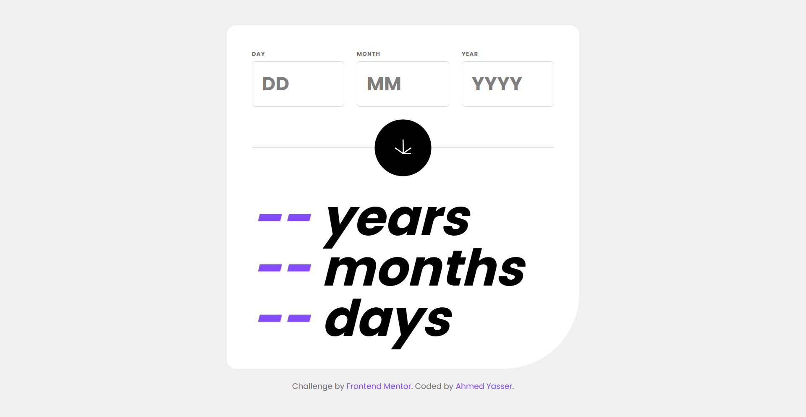
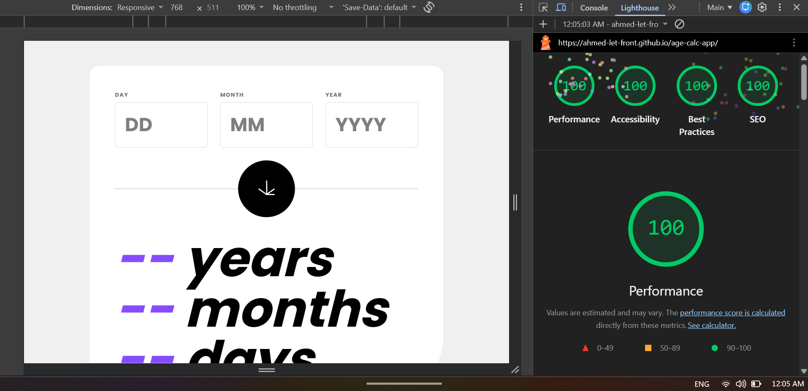

# Age Calculator App

## Overview & Project Scope

Welcome to the **Age Calculator App**, a modern, highly responsive, and robust web application designed to calculate precise age in years, months, and days. The design standards prioritize accessibility, optimal performance, and strict adherence to modern UI/UX patterns.

## Hero Preview



## Links

- **Live Demo URL:** [https://ahmed-let-front.github.io/age-calc-app/](https://ahmed-let-front.github.io/age-calc-app/)
- **Frontend Mentor Solution:** [https://www.frontendmentor.io/challenges/age-calculator-app-dF9DFFpj-Q](https://www.frontendmentor.io/challenges/age-calculator-app-dF9DFFpj-Q)

## Lighthouse Performance Audit



## AI Collaboration

- 🤖 **UI & Layout Assistance:** AI collaboration was utilized exclusively to assist with structuring and refining the user interface (UI) and layout architecture. All core calculation logic and programming were independently engineered and implemented by the author.

## Core Features & Logic Pipelines

- ⚙️ **Precise Age Calculation Engine:** Accurate mathematical logic handling leap years, variable month lengths, and strict date validations.
- 📱 **Responsive Grid & Flex Layout:** Fully optimized layout ensuring precise alignment and touch targets across mobile, tablet, and desktop viewports.
- 🎨 **Modern Typography & Styling:** Integration of custom Poppins font via Fontsource and fluid styling utilizing Tailwind CSS v4.
- 🛡️ **Custom Form Validation & State Management:** Robust error handling for empty inputs, future dates, invalid calendar days, and seamless form submission via the `novalidate` attribute.

## Tech Stack & Implementation Details

- 🧱 **Semantic HTML5 Markup:** Clean, accessible, and structured DOM hierarchy including dynamic branding footers.
- 💻 **Vanilla JavaScript (ES6+ Modules):** Modularized code structure leveraging modern ES6 features (Arrow functions, destructuring, module imports/exports).
- 🎨 **Tailwind CSS v4:** Utility-first styling utilizing advanced features, custom themes, and CSS variables.
- ⚡ **Vite:** Next-generation frontend tooling ensuring ultra-fast HMR (Hot Module Replacement) and optimized production builds.

## What I Learned & Architectural Highlights

Building this age calculator provided deep insights into handling date logic edge cases, managing DOM updates efficiently, and implementing custom form validations without relying on browser defaults. A major architectural takeaway was learning about the native `novalidate` attribute on the `<form>` element, understanding how it prevents the browser's built-in validation popups from interfering, and allowing complete control over custom error states and messages using JavaScript. Another key highlight was structuring modular ES6 code and ensuring a 400/400 Lighthouse performance score.

Here is a snippet of the custom form submission and input handling logic implemented in the project:

```javascript
// Example snippet handling form submission and input state management
const form = document.querySelector('form');

form.addEventListener('submit', function (e) {
  e.preventDefault();
  const focusedElement = document.activeElement;
  if (focusedElement && focusedElement.tagName === 'INPUT') {
    focusedElement.blur();
  }
});
```

## Project Initialization & Local Setup

To run this project locally, follow these steps:

## 1. Clone the repository:

```bash
git clone [https://github.com/Ahmed-let-front/calc-app.git](https://github.com/Ahmed-let-front/age-calc-app.git)
Navigate to the project directory:
```

## 2. Navigate to the project directory:

```bash
cd calc-app
Install dependencies:
```

## 3. Install dependencies:

```bash
npm install
Start the development server:
```

## 4. Start the development server:

```bash
npm run dev
Build for production:
```

## 5. Build for production:

```bash
npm run build
```

---

## Vite Build Configuration

The project uses an optimized **vite.config.js** file tailored for production asset bundling and vendor chunk splitting:

```javascript
import { defineConfig } from 'vite';
import tailwindcss from '@tailwindcss/vite';

export default defineConfig({
  plugins: [tailwindcss()],
  base: '/age-calc-app/',
  build: {
    sourcemap: false,
    rollupOptions: {
      output: {
        assetFileNames: 'assets/[name]-[hash][extname]',
        chunkFileNames: 'assets/[name]-[hash].js',
        entryFileNames: 'assets/[name]-[hash].js',
        manualChunks(id) {
          if (id.includes('node_modules')) {
            return 'vendor';
          }
        },
      },
    },
  },
});
```

---

## Author

GitHub: [ahmed-let-front](https://github.com/Ahmed-let-front)

Frontend Mentor: [Ahmed yasser](https://www.frontendmentor.io/profile/Ahmed-let-front)

LinkedIn: [Ahmed Yasser](https://www.linkedin.com/in/ahmed-yasser-frontend/)

---

**Thanks** Create By **UIO** ❤️
